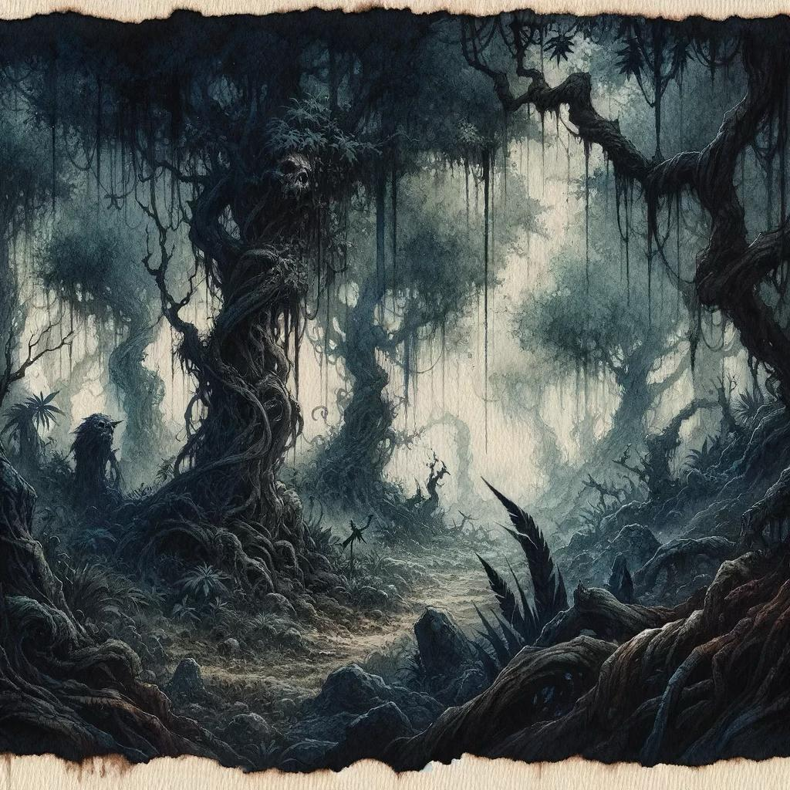
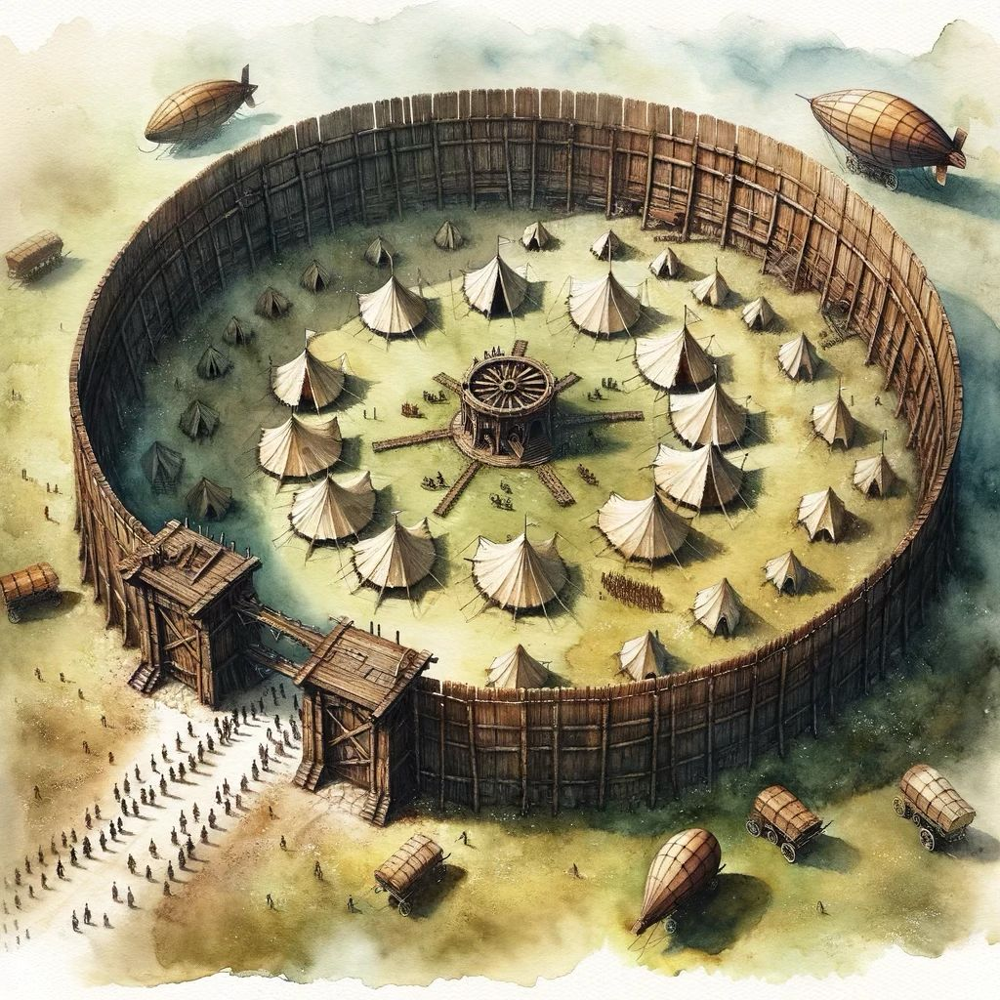

# Intro:
Nearly a week of mostly uneventful travel has provided a much needed opportunity for the party to rest and recover after the battle to rescue Giuseppe. Wounds healed, damages repaired, and bonds forged, the party has not sat idle as the peaceful miles flew past. Unfortunately, peace is not free, and the party has become acutely aware of their limited supplies. Looking for work, goods, and maybe even answers to the growing mystery that plagues Gaia, the party arrives at the Lansraad Outpost on a narrow strip of land just north of Aurelia’s aptly named jungle, the Twisted Green. The jungle is famous for the intricate vine growths and shadowed ground caused by the dense canopy, but it looks sick and diseased. Green has given way to gray and it’s clear that something is horribly wrong.

The party’s arrival, well-timed with that of the centaur war party, and subsequent martial assistance during the blight attack seems to have raised the spirits of the Aurelian soldiers stationed in the outpost. Nearby soldiers look at your motley group in hope before quickly returning to their tasks. It’s clear that this recent blight attack is not the first. You get the impression that these attacks are all part of the army’s new routine, though a very much unwelcome addition based on the soldier’s darting eyes and harried looks. A near constant stream of centaurs riding between the outpost, the jungle, and a nearby camp of makeshift huts suggests that the centaurs are acting as the scouts and cavalry of this cooperative operation. They seem to have a similar disposition as the Aurelian soldiers, though it’s difficult to tell behind their stern warrior’s visage.
# Events:
The next morning, the plan of attack is executed. The Lansraad army barely penetrates the jungle before they are ambushed by blight monsters. The centaur war parties gallop into battle, targeting the rear of the blight horde in an attempt to distract or kill the black robed figure. As the chaos ensues, the party slips into the jungle unnoticed.

After a half day’s travel, the party stops to assess the situation. West and Valkyrie recon the area and discover that the party’s position in the jungle doesn’t seem to match the pace and duration of their travel. Red casts Detect Magic and determines that the party is caught in an enchantment that is affecting their location. Unable to find an immediate solution, the party continues walking, led by Theo’s unerring sense of direction and Red’s obstinate desire to walk right into the face of danger.

After a full day of travel, tensions rise as some members of the party panic at the lack of progress and looming threat of the diseased jungle around them. Eventually, Re the fox picks up an unusual scent and leads the party in a new direction. Another full day of walking brings the party to the jungle’s coastal edge, right next to a small village of lizardfolk.

Red walks straight towards the village, and the party is discovered when Theo yells for him to stop. Two lizardfolk fishermen, armed with harpoons, run out to investigate. Red, Harold, and Fran try to communicate with them with little success, but the two fishermen visibly react when Harold draws a (very rough) picture of a cloaked figure in the dirt. The lizardfolk summon the village shaman, who speaks Common and leads the party to the village communal space.

The shaman tells the party that a cloaked human has been visiting their village and asking for the lizardfolk to join “the cause” but she couldn’t elaborate on what that means. When the tribe refused, the human began making threats. The tribe continued to refuse, and the human was later seen walking into the ocean. Soon after, a group of sahuagin began raiding the village week after week. The shaman asked the party to defeat the sahuagin, and in return, she could show them the way through the jungle’s enchantments.

The party tries to persuade the shaman that the real threat is the cloaked human in the jungle and not the sahuagin raiding party, but she is convinced that the sahuagin will continue attacking even if the human is killed. Aisling and Re, reading the body language of the lizardfolk, see that the shaman is truly desperate and that her tribe is beaten down and terrified by these recent events. Eventually, the party agrees to help.

The party doesn’t want to wait until the next raid, so they instead plan a trap. Aisling (wild shaped as a dolphin), Wither (wild shaped as a crocodile), and West (sporting his new dingy cap of water breathing), dive into the water to bait the sahuagins. Red and Harold prepare a giant net trap on the village dock while the rest of the party assume battle positions for an ambush.

The aquatic trio discover the sahuagins not far from shore, lurking in a kelp forest on the deep side of a drop off in the sea floor. Aisling wriggles like enticing dolphin bait and West telepathically transmits an image of a roasted and lemon zested sahuagin as the main course of a lizardfolk feast. Properly enraged, the sahuagin quickly pursue the trio as they make their escape with Wither acting as a rearguard.

The trio and their pursuers reach the beach and the trap is sprung. Arrows fly, spells sizzle, jaws chomp, blades swing, nets entangle, poop lands with precision accuracy, and noses are violated in the resulting combat. The party paints a scene of blood and death, capturing three sahuagin alive and killing the rest, though just barely killing the baron during his attempt to flee the combined terrors of Fran and West.

West and Theo loot the bodies, finding a pair of magical amulets and an enchanted trident on the body of the baron but not much else. The rest of the party pulls their captives to shore and turn to face the lizardfolk, huddled together and cowering in fear at the scene.

# Character Interactions:
Aisling revealed Re’s ability to sense people’s auras and her powerful insight.

Francesca is a glutton for pastries, specifically almond croissants.

Harold is always fixing for a fight, and when a fight can’t be had, then he does pushups until he collapses.

Red’s mood appeared to fluctuate day to day, seeming to mirror his divine abilities that also change day to day.

Theo was crushing on the centaur war leader and also showed signs of panic and claustrophobia after an extended time in the diseased jungle.

West emerged from his brooding shell and became an elf of action when confronted by an unnatural threat to the natural world.

Wither is always jonesing for a smoke, and is a terror whenever she assumes her wild shape.
# Character Highlights:
Aisling and Re’s combined abilities helped keep the party safe by discerning the true intent of others and by acting as scouts in dangerous territory.

Fran terrorized a sahuagin baron by grappling his nose hairs and blasting him with alchemical powders like a crazed cocaine dispensing machine.

Harold became an executioner, chopping heads left and right (much to Red’s dismay).

Morg was seen flying off into the Twisted Green alone.

Red was a failed lizardfolk diplomat but an excellent sahuagin kidnapper. His javelin economy is also terrible.

Skaaldir repaired his damaged prosthetic leg and directed the repairs and upgrade to the Bright Eye.

Theo was a whirlwind of jungle might, firing arrows that sprouted sharp, tangling vines and arrows that transformed into hails of piercing thorns, creating a scene that could be construed as having an affinity to the blight monsters…

West, along with Fran, laid low the sahuagin baron with his piercing psionic attacks and thwarted a strange psionic retaliation that appeared to come from the baron’s mind.

Wither painted a scene of gore and death in her crocodile wild shape, becoming a cyclone of terror as she tore the sahuagin warriors limb from limb.
# Character Blunders:
# Notable Role-Playing:
# Loot Obtained:
